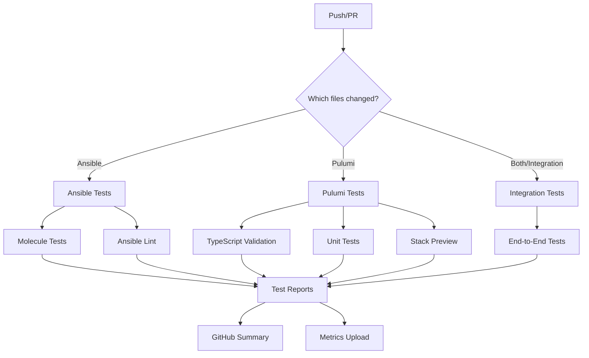

# Testing Workflow
- Local Development: Test code with pre-commit hooks and manual test runs
- CI/CD Pipeline: Automated testing via GitHub Actions on push or pull request
- Monitoring: Track test results, metrics, and logs through dashboards
- Alert: Get notified of test failures or system anomalies

## 🚀 Getting Started

### Prerequisites
Before you begin, ensure you have:

- Python 3.10+ installed
- Docker installed and running
- Git configured
- Access to a Kubernetes cluster (for deployment tests)
- Access to GitHub (for CI/CD)

### Setting Up Your Environment
Clone the repository:
```bash
git clone https://github.com/SPRIME01/homelab-infra.git
cd homelab-infra
```

Set up a Python virtual environment:
```bash
uv venv .venv
source .venv/bin/activate  # On Windows: .venv\Scripts\activate
```

Install dependencies:
```bash
uv pip install -e ".[dev]"
```

Install pre-commit hooks:
```bash
pre-commit install
pre-commit install --hook-type commit-msg
```

Configure environment variables:
```bash
cp .env.example .env
# Edit .env with your configuration
```

## 🔍 Local Testing

### Running Ansible Role Tests
To test individual Ansible roles:
```bash
# Test a specific role with all test stages
./scripts/test-ansible.sh -r <role_name>

# Test with specific stages
./scripts/test-ansible.sh -r <role_name> -s lint -s syntax -s dry-run
```
Available stages:

- lint: Check style and best practices
- syntax: Verify syntax without execution
- dry-run: Execute in check mode
- check: Full test with idempotence check
- apply: Apply changes (use cautiously)

Example:
```bash
./scripts/test-ansible.sh -r k3s_server -s lint -s dry-run
```

### Running Pulumi Tests
Test Pulumi infrastructure code:
```bash
# Test all Pulumi stacks
./scripts/test-pulumi.sh

# Test specific stack
./scripts/test-pulumi.sh -s cluster-setup

# Only run validation (TypeScript check)
./scripts/test-pulumi.sh --validate-only

# Only run unit tests
./scripts/test-pulumi.sh --test-only

# Only run preview
./scripts/test-pulumi.sh --preview-only
```

Example testing the storage stack with increased verbosity:

```bash
./scripts/test-pulumi.sh -s storage --verbose
```

### Running Molecule Tests
Execute Molecule tests for Ansible roles using our helper script:
```bash
# Run all Molecule stages for a role
./scripts/run-molecule-tests.sh <role_name>

# Run specific commands
./scripts/run-molecule-tests.sh -c lint <role_name>
./scripts/run-molecule-tests.sh -c converge <role_name>
./scripts/run-molecule-tests.sh -c verify <role_name>

# Run with a specific scenario
./scripts/run-molecule-tests.sh -s ha-cluster <role_name>

# Enable verbose output
./scripts/run-molecule-tests.sh -v <role_name>
```

Example:
```bash
./scripts/run-molecule-tests.sh k3s_server
./scripts/run-molecule-tests.sh -c converge k3s_server
```

### Running End-to-End Tests
Execute end-to-end tests that verify the entire infrastructure:
```bash
# Run all tests
uv run pytest tests/

# Run specific test categories
uv run pytest tests/ -m prometheus
uv run pytest tests/ -m loki
uv run pytest tests/ -m k8s

# Run with output to Prometheus metrics
PUSHGATEWAY_URL=http://localhost:9091 TEST_RUN_ID=manual-$(date +%s) pytest tests/
```

## 🔄 Pre-commit Hooks
Pre-commit hooks run automatically when you commit code to ensure quality and consistency.

### Available Hooks
| Hook | Description | Configuration |
|------|-------------|---------------|
| trailing-whitespace | Removes trailing spaces | Built-in |
| end-of-file-fixer | Ensures files end with a newline | Built-in |
| check-yaml | Validates YAML files | Built-in |
| check-json | Validates JSON files | Built-in |
| detect-private-key | Prevents committing keys | Built-in |
| gitleaks | Scans for secrets | .pre-commit-config.yaml |
| yamllint | Lints YAML files | .yamllint |
| markdownlint | Lints Markdown files | .markdownlint.yaml |
| ansible-lint | Lints Ansible files | .ansible-lint.yml |
| black | Formats Python code | pyproject.toml |
| isort | Sorts Python imports | pyproject.toml |
| molecule-lint | Runs Molecule lint | .pre-commit-config.yaml |
| pulumi-validate | Validates Pulumi code | .pre-commit-config.yaml |
| conventional-pre-commit | Enforces commit message style | .pre-commit-config.yaml |

### Hook Configuration
The hooks are defined in .pre-commit-config.yaml. Key configurations:

```bash
# Molecule testing (local hook)
- id: molecule-lint
  name: Molecule Lint
  entry: bash -c 'cd ${MOLECULE_DIR:-.} && python -m molecule lint'
  language: system
  pass_filenames: false
  files: ansible/roles/
  types: [directory]

# Pulumi validation (local hook)
- id: pulumi-validate
  name: Pulumi TypeScript Validation
  entry: bash -c './scripts/test-pulumi.sh --validate-only'
  language: system
  pass_filenames: false
  files: pulumi/
```

### Running Pre-commit Manually
Test your code against all pre-commit hooks:
```bash
pre-commit run --all-files
```

Run specific hook:
```bash
pre-commit run molecule-lint --all-files
pre-commit run pulumi-validate --all-files
```

## ⚙️ CI/CD Pipeline
Our CI/CD pipeline uses GitHub Actions for automated testing and deployment.

### GitHub Actions Workflows
The pipelines are defined in the .github/workflows/ directory:

- ansible-tests.yml: Tests Ansible roles and playbooks
- pulumi-tests.yml: Tests Pulumi infrastructure code
- molecule-tests.yml: Runs Molecule tests for all roles
- integration-tests.yml: Runs end-to-end integration tests

### Pipeline Structure



### Test Matrix Configuration
The GitHub Actions workflows use test matrices to test multiple configurations in parallel:
```yaml
# Example matrix from ansible-tests.yml
strategy:
  matrix:
    role: 
      - k3s_server
      - k3s_agent
      - home_assistant_integration
    os:
      - ubuntu-22.04
      - ubuntu-20.04
```

## 📈 Monitoring and Dashboards
Our monitoring system provides real-time insights into test results and system performance.

### Dashboard Overview
The monitoring stack consists of:

- Prometheus: Collects and stores metrics
- Loki: Aggregates and indexes logs
- Grafana: Visualizes metrics and logs
- Alert Manager: Handles notifications

### Accessing Dashboards
Port-forward Grafana service:
```bash
kubectl port-forward -n monitoring svc/grafana 3000:3000
```
Access Grafana at http://localhost:3000

Login with your credentials (default: admin/admin)

### Deploying Dashboards
Deploy dashboards using the deploy-dashboards.sh script:
```bash
# Deploy all dashboards
./scripts/deploy-dashboards.sh

# Deploy a specific dashboard
./scripts/deploy-dashboards.sh --dashboard host-monitoring

# List available dashboards
./scripts/deploy-dashboards.sh --list

# Deploy to a different namespace
./scripts/deploy-dashboards.sh --namespace observability
```

### Available Dashboards
| Dashboard | Description | Path |
|-----------|-------------|------|
| Test Results | Shows test pass/fail rates and duration | monitoring/grafana/dashboards/test-results-dashboard.json |
| Kubernetes Cluster | Monitors cluster health | monitoring/grafana/dashboards/k8s-cluster-dashboard.json |
| Application Performance | Tracks app metrics | monitoring/grafana/dashboards/app-performance-dashboard.json |
| Pulumi Deployment | Visualizes deployments | monitoring/grafana/dashboards/pulumi-deployment-dashboard.json |
| Host Monitoring | Shows host resource usage | monitoring/grafana/dashboards/host-monitoring-dashboard.json |
| Log & Metric Correlation | Combines logs and metrics | monitoring/grafana/dashboards/log-metric-correlation-dashboard.json |

## 📊 Metrics Collection

### Prometheus Integration
Test results and system metrics are stored in Prometheus. The integration is configured in:

- tests/utils/prometheus_helper.py: Helper for test metrics
- monitoring/prometheus/prometheus.yaml: Main configuration

Key metrics collected:

- test_duration_seconds: Test execution time
- test_success_total: Count of successful tests
- test_failure_total: Count of failed tests
- test_resource_usage: Resource consumption during tests
- pulumi_deployment_success: Deployment success status
- pulumi_deployment_duration_seconds: Deployment duration

Example Python test using metrics:

```python
@pytest.mark.prometheus
def test_cluster_health(host, prometheus_test_metrics):
    """Test cluster health with Prometheus metrics recording."""
    # Setup test metrics
    prometheus_test_metrics.start_timer('cluster_health')
    
    # Perform the actual test
    result = host.run('kubectl get nodes')
    
    # Record test results
    if result.rc == 0:
        prometheus_test_metrics.increment_success()
        
        # Record custom metrics
        node_count = len(result.stdout.strip().split('\n')) - 1
        prometheus_test_metrics.add_metric('k8s_node_count', node_count)
        
        # Record resource usage
        mem_info = host.run('free -m').stdout
        prometheus_test_metrics.add_metric('host_memory_used_mb', 
                                          int(re.search(r'Mem:\s+\d+\s+(\d+)', mem_info).group(1)))
    else:
        prometheus_test_metrics.increment_failure()
    
    # Stop timer and push metrics
    prometheus_test_metrics.stop_timer('cluster_health')
    prometheus_test_metrics.push_metrics()
    
    # Assert test condition
    assert result.rc == 0, f"Failed to get nodes: {result.stderr}"
```

## 📣 Alerts and Notifications

### Alert Configuration
Alerts are configured in monitoring/alertmanager/alerts.yaml:

```yaml
groups:
- name: test-alerts
  rules:
  - alert: TestFailureRate
    expr: sum(increase(test_failure_total[1h])) / sum(increase(test_success_total[1h]) + increase(test_failure_total[1h])) > 0.2
    for: 5m
    labels:
      severity: critical
    annotations:
      summary: "High test failure rate"
      description: "Test failure rate is {{ $value | humanizePercentage }} over the last hour"
```

### Notification Channels
Configure notification channels in Grafana or AlertManager:

- Email: Daily test summaries
- Slack: Real-time alerts
- PagerDuty: Critical failures

## 🔄 Continuous Improvement

We track test metrics over time to identify:

- Flaky tests
- Performance regressions
- Coverage gaps

Regularly review test results in retrospective meetings and adjust testing strategy accordingly.